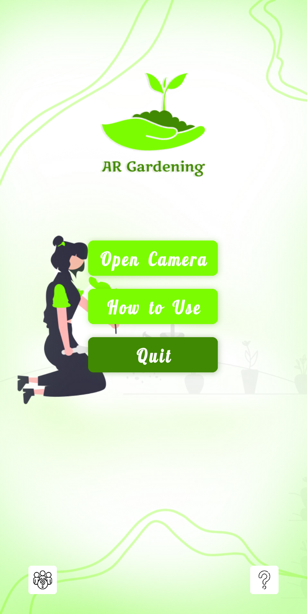
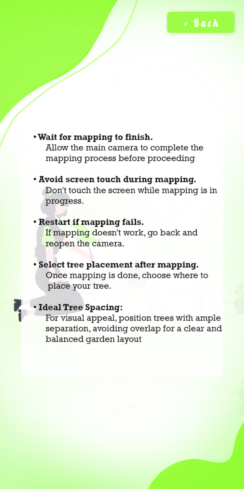
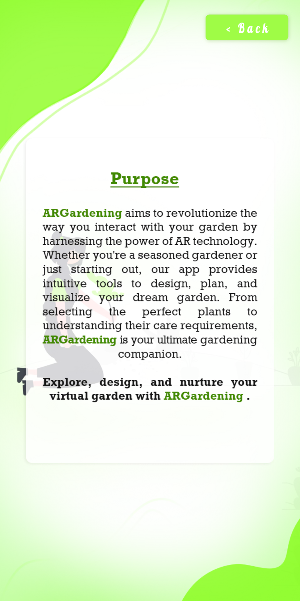
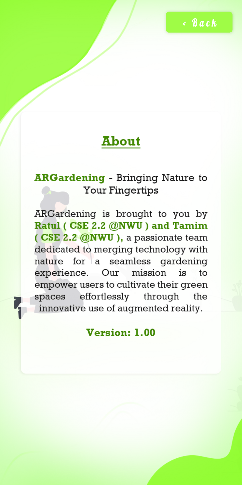
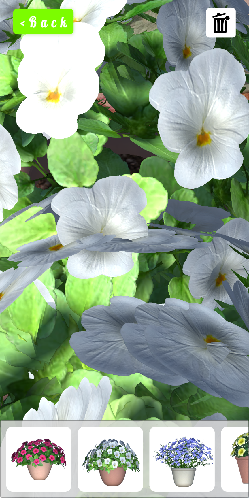

AR Gardening with Unity AR Foundation
============

    
    <h1>AR Gardening</h1>
    
An Android application for Planting Virtual Plant in Real Life

---

  
  
  
  
  
  

## Features
- Placement of virtual plants in real-world environments.
- Interaction with virtual plants, including delete functionality.
- Realistic rendering of plants for enhanced immersion.
- Intuitive user interface for seamless navigation and control.

## Installation

